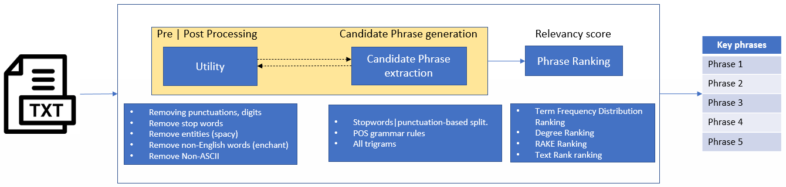

# PhraseExtraction

[PhraseExtraction](https://pypi.org/project/PhraseExtraction/) is a research library with variety keyphrase extraction techniques. The software has three components.
1. Utility - all preprocessing modules
2. Candidate phrase generation
3. Ranking/Scoring Techniques

Currently implemented Techniques are:

- Candidate Phrase Generation : 
    - Stopwordbased split
    - POS Grammar based selection
    - Ngrams 
- Ranking Techniques :
    - Term Frequency Distribution
    - RAKE Ranking (RAKE, Degree)
    - Text Ranking (Embedding, Window)
    
    

## Available Methods

| Methods | Options |
| -------- | -------- |
| Text Cleaning | **Stopwords Removal** <br/> **Punctuation/Digit removal** <br/> **Entities Removal** <br/> **Non-english word removal** <br/> **Non-ASCII filtering** |
| Candidate Generation | **Stopword based Split** <br/> **POS Grammar based selection** <br/> **Ngrams** |
| Ranking | **Mean TF Distribution** <br/> **RAKE/Degree Ranking** <br/> **TextRank** |

# Table of contents

<!--ts-->
- [PhraseExtraction](#phraseextraction)
- [Table of contents](#table-of-contents)
- [Installation](#installation)
- [Usage](#usage)
  - [Utility](#usage)
  - [Phrase Extraction](#phrase-extraction)
  - [Phrase Ranking](#phrase-ranking)
- [Support and Contributions](#support-and-contributions)
- [Acknowledgement](#acknowledgement)
- [License](#license)

# Installation
Assuming that anaconda environment is already installed,

- PhraseExtraction can be installed from PyPI using

```
pip install PhraseExtraction
```

- with requirements.txt

```
pip install -r requirements.txt
```

- with yml file, create conda environment

```
conda env create -f environment.yml
source activate env
```

# Usage

Example notebooks can be found in the `sample_notebooks` directory.
Usage of each method/technique is described in sections below.
<br/>

## Utility

It contains text pre-processing methods. The sample code for usage is provided below.
<br/>

```python

# Load stopwords
from phraseextraction.utility import nltk_stopwords, spacy_stopwords, gensim_stopwords, smart_stopwords, all_stopwords
print(nltk_stopwords, spacy_stopwords, gensim_stopwords, smart_stopwords, all_stopwords)

# Remove Non-ASCII characters/symbols
from phraseextraction.utility import filter_nonascii
nonascii_text = filter_nonascii(text)

# Remove punctuation & digits
from phraseextraction.utility import remove_punct_num
text_with_punc_digit_removed = remove_punct_num(text, remove_num=True)

# Remove Non-english words (junks like website, url etc)
from phraseextraction.utility import remove_non_english
english_text = remove_non_english(text)

# Remove entities using list of entities to removes
from phraseextraction import remove_named_entities
ent_list=['DATE','GPE','PERSON','CARDINAL','ORDINAL','LAW','LOC','PERCENT','QUANTITY']
ents_removed_text = utility.remove_named_entities(text, ent_list)

# Check if a token is digit
from phraseextraction import is_number
num_bool = is_number(token)

```

## Candidate Phrase Generation

This section describes usage for 3 techniques of keywords/phrase extraction.

1. Grammar based phrase extraction requires user to define POS tags pattern for the kind of phrases one wants to pick. Rules are defined in rule.py.

```python
from rule import grammar
from candidate_generation import Grammar_Keyphrase

grammar_model = Grammar_Keyphrase(grammar)
key_phrases = grammar_model.get_keyphrases(text)
```

2. RAKE based phrase extraction required list of stopwords to split the sentences to get candidate phrases. By default we use, combined stopwords from nltk, gensim, spacy and smartstop list.

```python
from candidate_generation import Rake_Keyphrase

# ngram_ : The lower and upper boundary of the range of n-values for different word n-grams (2,4) means bi, tri and quad grams only.
rake_model = Rake_Keyphrase(ngram_ = (2,4), custom_stop_words=custom_stop_words)
key_phrases = rake_model.get_keyphrases(text)
```

3. Ngrams based extracts all possible overlapping N-grams. Preprocessing and cleaning text is important step here.

```python
from candidate_generation import Ngram_Keyphrase

ngram_model = Ngram_Keyphrase(ngram_ = (3,3))  #only trigrams
key_phrases = ngram_model.get_keyphrases(text)
```


## Phrase Ranking

How do we know which are important keywords ? Importance can be based for various premises example counts, association or centrality. This section describes methods for ranking phrases extracted from candidate phrase generation techniques.

1. RAKE/Degree Scoring:  Method can take RAKE or Degree scoring. To understand scoring more, one can refer RAKE paper [here](https://catalogimages.wiley.com/images/db/pdf/9780470749821.excerpt.pdf).

```python
from ranking import RakeRank

rakeRank = ranking.RakeRank(method='degree')
ranked_df = rakeRank.rank_phrases(key_phrases)
```


2. TextRank: TextRank has two methods: Window based (WindowSize) & Embedding based (WordEmbeddings). Embedding based ranking are recommended. Currently, it uses glove embedding but we intend to extend the technique to wor2vec, BERT, custom embedding models as well.

```python
from ranking import TextRank

TR_WordEmbedding= ranking.TextRank(method= "WordEmbeddings")
ranked_df = TR_WordEmbedding.rank_phrases(key_phrases)
```


3. Mean Term Frequency Scoring: Uses token count frequencies to score keyphrases by taking mean probability distribution of each token in keyphrase.

```python
from ranking import FrequencyDistRank

# takes original text/doc as input to calculate count stats
freqDistRank = ranking.FrequencyDistRank(text)
ranked_df = freqDistRank.rank_phrases(key_phrases)
```

# Support and Contributions

Please submit bug reports and feature requests as Issues.
Contributions are very welcome.

For additional questions and feedback, please contact us at PhraseExtraction@fmr.com

# Acknowledgement

PhraseExtraction is developed under a mentorship program at Fidelity Investments.

# License

PhraseExtraction is licensed under the [Apache License 2.0.](LICENSE.md)
